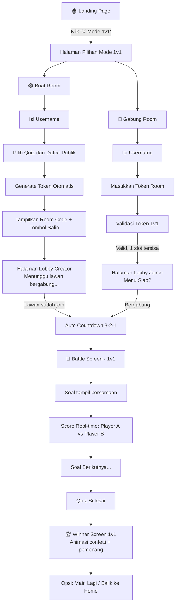

# 🎮 Mode 1 vs 1 — Duel Battle Quiz

Fitur baru di QuizClass: **Mode Duel 1 vs 1**, di mana user bisa membuat room sendiri, men-generate token, dan mengundang satu lawan untuk bertarung quiz secara langsung — tanpa perlu login sebagai admin!

> [!IMPORTANT]
> **Keputusan Sudah Dikonfirmasi:**
> - ✅ **Quiz**: Hanya quiz yang ditandai admin sebagai `allow1v1: true` yang bisa dipilih creator
> - ✅ **Start**: Manual — creator harus klik tombol "⚔️ Mulai Battle!" setelah lawan bergabung

---

## Mockup UI & Desain


---

## 📌 Ringkasan Fitur

- Tombol **"⚔️ Mode 1v1"** ditambahkan di halaman Landing Page, tepat di bawah tombol "Gas Masuk!"
- User dapat **membuat room** sendiri (pilih quiz + generate token 6 digit)
- User dapat **bergabung ke room** yang sudah dibuat temannya
- Ketika kedua player sudah bergabung → game **auto-start** (tidak perlu admin)
- Battle terjadi secara **real-time**, skor ditampilkan di samping satu sama lain
- Setelah selesai, tampil **Winner Screen** khusus 1v1

---

## 🔄 Alur Lengkap (User Flow)



---

## 🎨 Desain UI Per Halaman

### 1. Landing Page — Tambahan Tombol 1v1
- Tombol **"⚔️ 1v1 Battle"** muncul di bawah tombol "Gas Masuk!" dalam form card
- Desain: gradient merah-oranye, border glowing, dengan ikon pedang bersilang
- Efek hover: shake animation + glow intensif

### 2. Halaman `/duel` — Pilih Mode
Dua card besar dengan animasi hover:
| Card Kiri | Card Kanan |
|-----------|------------|
| 🟣 **Buat Room** | 🔵 **Gabung Room** |
| "Saya ingin membuat room dan mengundang teman" | "Saya punya kode room dari teman" |
| Gradient purple | Gradient blue |

### 3. Halaman `/duel/create` — Buat Room
- Input: username
- List quiz tersedia (card dengan nama quiz + jumlah soal)
- Tombol "Buat Room & Generate Kode"
- Setelah klik → muncul **token chip** besar dengan tombol salin 📋
- Status: "Menunggu lawan bergabung…" dengan animasi pulse

### 4. Halaman `/duel/join` — Gabung Room
- Input: username
- Input: kode token 6 digit (sama style dengan landing page)
- Validate: token harus bertipe `duel` dan masih bisa diisi (1 slot tersisa)
- Redirect ke `/duel/lobby/:token`

### 5. Halaman `/duel/lobby/:token` — Lobby 1v1
- **Layout Split**: Player 1 (creator) di kiri | **VS** di tengah | Player 2 (joiner) di kanan
- Avatar + username masing-masing player
- Jika slot masih kosong: animasi waiting/pulsing di sisi lawan
- Creator melihat tombol "Mulai Battle!" (aktif hanya jika lawan sudah join)
- Joiner melihat: "Siap! Menunggu host memulai..."
- Auto-start ketika kedua player bergabung (opsional/bisa manual dari creator)

### 6. Battle Screen `/duel/quiz`
- **Scoreboard mini** di atas layar: `[Avatar1] Nama1 — SCORE — Nama2 [Avatar2]`
- Soal tampil di tengah seperti biasa
- Progress bar timer soal
- Setiap jawaban → score lawan diupdate real-time (efek +/- terbang)

### 7. Winner Screen `/duel/winner`
- Animasi **confetti** meledak
- Pemenang: avatar besar + mahkota 👑
- Skor akhir keduanya ditampilkan
- Tombol: "🔄 Rematch" | "🏠 Kembali ke Home"

---

## 🏗️ Arsitektur Teknis

### Backend

#### [NEW] Model `DuelRoom`
```ts
{
  token: string,           // 6 karakter unik
  quizId: ObjectId,        // Quiz yang dipakai
  status: 'waiting' | 'countdown' | 'active' | 'finished',
  creator: {               // Player yang membuat room
    socketId: string,
    username: string,
    avatar: IAvatar,
    score: number,
    answers: IAnswer[],
  },
  opponent: {              // Player yang diundang (bisa null)
    socketId: string | null,
    username: string | null,
    avatar: IAvatar | null,
    score: number,
    answers: IAnswer[],
  },
  currentQuestion: number,
  startedAt?: Date,
  finishedAt?: Date,
  createdAt: Date,
  expiresAt: Date,         // Auto-expire 30 menit jika tidak ada lawan
}
```

#### [NEW] Routes `/api/duel`
| Method | Path | Deskripsi |
|--------|------|-----------|
| `GET` | `/api/duel/quizzes` | Ambil daftar quiz yang di-allow 1v1 oleh admin |
| `POST` | `/api/duel/create` | Buat room 1v1, generate token, return room data |
| `GET` | `/api/duel/:token/info` | Cek info room (status, apakah masih bisa join) |

#### [NEW] Socket Handler `duel.socket.ts`
| Event | Arah | Deskripsi |
|-------|------|-----------|
| `duel:create` | Client→Server | Buat room & join sebagai creator |
| `duel:join` | Client→Server | Bergabung ke room sebagai opponent |
| `duel:setAvatar` | Client→Server | Set avatar player |
| `duel:startBattle` | Client→Server | Creator klik tombol "Mulai Battle!" (manual) |
| `duel:answer` | Client→Server | Kirim jawaban |
| `duel:reaction` | Client→Server | Kirim reaksi emoji |
| `duel:roomUpdate` | Server→Client | Update status room (lawan join, dll) |
| `duel:countdown` | Server→Client | Countdown 3-2-1 |
| `duel:questionStart` | Server→Client | Soal baru dimulai |
| `duel:questionEnd` | Server→Client | Soal selesai + hasil |
| `duel:scoreUpdate` | Server→Client | Real-time score kedua player |
| `duel:finished` | Server→Client | Battle selesai + pemenang |
| `duel:error` | Server→Client | Error handling |
| `duel:opponentLeft` | Server→Client | Lawan disconnect |

### Frontend

#### Pages Baru
| Path | Keterangan |
|------|-----------|
| `/duel` | Halaman pilihan: Buat Room vs Gabung Room |
| `/duel/create` | Form buat room: username + pilih quiz (hanya yg allow1v1) |
| `/duel/join` | Form gabung room: username + token |
| `/duel/lobby` | Lobby 1v1 split-screen — Creator lihat tombol "Mulai Battle!" |
| `/duel/quiz` | Battle screen dengan scoreboard mini |
| `/duel/winner` | Winner screen dengan animasi |

#### Store Baru `duelStore.ts`
```ts
{
  // Room
  token: string,
  quizId: string,
  role: 'creator' | 'opponent' | null,
  
  // Players
  me: DuelPlayer,
  opponent: DuelPlayer | null,
  
  // Game state  
  status: DuelStatus,
  currentQuestion: Question | null,
  questionIndex: number,
  countdown: number | string,
  result: QuestionResult | null,
}
```

---

## ⚙️ Perbedaan Mode Normal vs Mode 1v1

| Aspek | Mode Normal (Kelas) | Mode 1v1 |
|-------|--------------------|----|
| Jumlah pemain | Banyak (unlimited) | Tepat 2 orang |
| Siapa yang buat room | Admin login | Player biasa |
| Kontrol game | Admin panel | Auto (creator klik mulai) |
| Tampilan battle | Leaderboard banyak | Split head-to-head |
| Quiz  | Admin yang tentukan | Creator pilih |
| Lobby | Tunggu admin mulai | Auto start / Creator |
| Winner screen | Podium 1/2/3 | 1v1 Duel Winner |

---

## ✅ Verification Plan

### Automated
- Unit test untuk `DuelRoom` model dan token generation
- Test API endpoint `/api/duel/create` dan `/api/duel/:token/info`

### Manual
1. Buka dua tab browser → Test alur create + join
2. Pastikan kedua player menerima soal bersamaan
3. Test disconnect handling (salah satu player putus)
4. Test auto-expire room jika lawan tidak datang dalam 30 menit
5. Verifikasi winner screen muncul dengan pemenang yang benar

---

## ✅ Semua Keputusan Sudah Dikonfirmasi

> [!NOTE]
> **Quiz Allow 1v1**: Admin menentukan quiz mana yang boleh dipakai di mode 1v1. Di panel admin, akan ditambahkan toggle `Allow 1v1` per quiz.

> [!NOTE]
> **Start Manual**: Creator harus klik tombol **"⚔️ Mulai Battle!"** setelah lawan join. Tombol aktif hanya ketika lawan sudah bergabung dan memilih avatar.

> [!NOTE]
> **Auth Creator**: Siapapun bisa buat room 1v1 tanpa login admin. Quiz yang tersedia hanya yang sudah diizinkan admin via toggle `allow1v1`.
